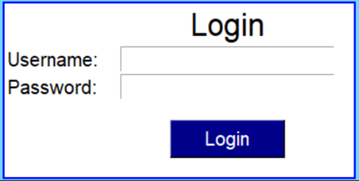

# TO DO app

### This is a ToDo app that records all the daily tasks. 
In this app you can enter your task with deadlines and also the status.

#### GitHub url: 
> https://github.com/sorinacizer/ToDo-app

### Grafic Interface:


### How to record your tasks:
1. Register, if you are a new user;
2. Login
3. Add your tasks

This is a code example:
```commandline
      def add_task_deadline(self):
        task = self.entry_task.get()
        selected_date = self.cal.get_date()
        var = self.var.get()
        self.tree_view.insert('', 'end', values=(task, selected_date, var))

        self.entry_task.delete(first='0', last='-1')
        self.entry_task.focus()
        self.entry_task.after(1000, lambda: self.task_var.set(''))
```

#### Register:


#### Login:
